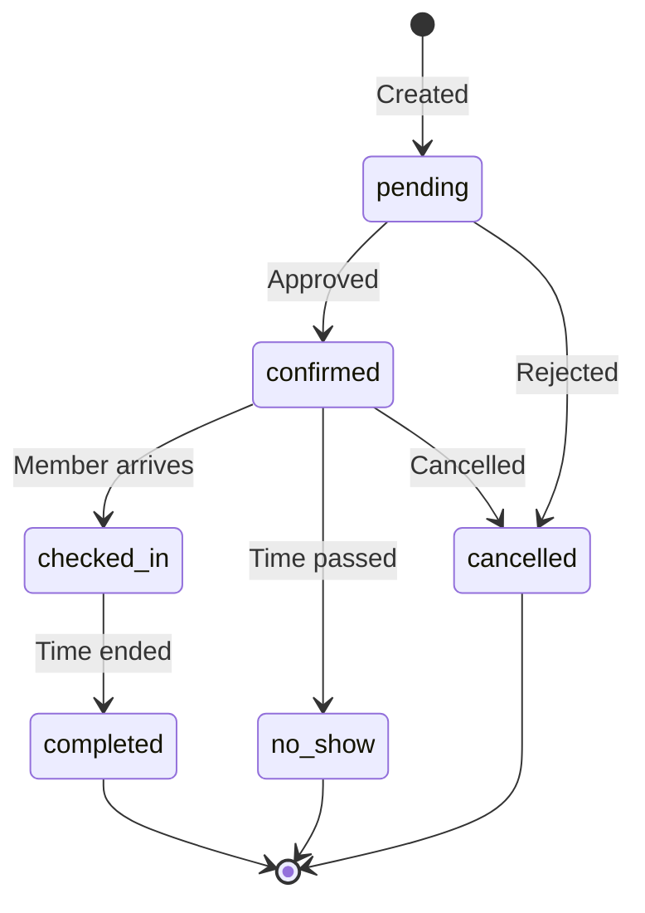

قبل بناء تكاملك، من المهم أن تفهم كيف تنظّم Rntor البيانات. تغطي هذه الصفحة الكيانات الرئيسية والعلاقات بينها.

## التسلسل الهرمي للتاجر

تستخدم Rntor هيكلاً هرمياً لتنظيم المساحات والموارد:

```
Merchant (Organization)
├── Location (Physical Site)
│   ├── Floor (Optional)
│   │   └── Resource (Bookable Space)
│   └── Resource (Bookable Space)
└── Location
    └── Resource
```

### Merchant

يمثّل **Merchant** مؤسستك أو شركتك. إنه الكيان الأعلى الذي يمتلك جميع المواقع والعملاء والإعدادات.

- يمتلك علامة تجارية وإعدادات فريدة
- يحتوي على جميع بيانات الفوترة والاشتراكات
- يدير أعضاء الفريق والصلاحيات

### Location

**Location** هو موقع مادي أو مبنى. يمكن أن يكون لدى التجار مواقع متعددة.

- لديه عنوانه الخاص ومعلومات الاتصال
- يحتوي على ساعات العمل وأيام الإغلاق
- يجمع الموارد للإدارة

### Resource

**Resource** هو أي مساحة أو أصل قابل للحجز:

| النوع | الوصف | أمثلة |
|------|-------------|----------|
| `meeting_room` | غرف للاجتماعات | Conference Room A, Boardroom |
| `hot_desk` | مساحات مكاتب مرنة | Open Workspace Desk #1-50 |
| `private_office` | مكاتب مخصصة | Office Suite 201 |
| `event_space` | قاعات فعاليات كبيرة | Rooftop Terrace, Main Hall |
| `phone_booth` | مقصورات خاصة صغيرة | Phone Pod 1-4 |
| `parking` | أماكن لوقوف السيارات | Spot A1-A20 |

## نموذج العميل

تميّز Rntor بين العملاء الأفراد وحسابات الشركات:

```
Company (Optional)
├── Customer (Member)
├── Customer (Member)
└── Customer (Manager)
     └── Can manage company bookings
```

### Customer

**Customer** هو مستخدم فردي يمكنه:
- إجراء الحجوزات
- حضور الفعاليات
- استخدام الاعتمادات وتصاريح اليوم
- امتلاك اشتراكات

### Company

تجمع **Company** العملاء معاً من أجل:
- الفوترة المشتركة
- الاعتمادات وتصاريح اليوم المُجمَّعة
- الفوترة المركزية
- تخصيصات الموارد المخصصة

## دورة حياة الحجز

تمر الحجوزات بحالات محددة:



### حالات الحجز

| الحالة | الوصف |
|--------|-------------|
| `pending` | في انتظار التأكيد (في حال طلب الموافقة) |
| `confirmed` | تمت الموافقة عليه وجدولته |
| `checked_in` | وصل العميل |
| `completed` | انتهى وقت الحجز |
| `cancelled` | تم إلغاء الحجز |
| `no_show` | لم يحضر العميل |

## الاعتمادات وتصاريح اليوم

تدعم Rntor نماذج دفع مرنة:

### الاعتمادات (Credits)

عملة افتراضية لحجز الموارد:
- يمكن شراؤها في حزم
- مضمّنة في خطط الاشتراك
- تتبّع الإنفاق لكل عميل/شركة
- تدعم المدفوعات الجزئية

### تصاريح اليوم (Day Passes)

تصاريح وصول شاملة ليوم واحد:
- تمنح الوصول إلى أنواع موارد محددة
- يمكن تجميعها على مستوى الشركة
- غالباً ما تكون مضمّنة في خطط العضوية

## الاشتراكات والفوترة

عضويات متكررة مع فوترة آلية:

| دورة الفوترة | الوصف |
|---------------|-------------|
| `monthly` | فوترة في اليوم نفسه من كل شهر |
| `quarterly` | فوترة كل 3 أشهر |
| `annually` | فوترة مرة واحدة في السنة |

يمكن أن تشمل الاشتراكات:
- الوصول إلى مواقع محددة
- مخصصات اعتمادات شهرية
- مخصصات تصاريح يومية
- تخصيصات الموارد (مكاتب/مكاتب خاصة مخصصة)

## الفعاليات

فعاليات مجتمعية مع تسجيل:

- **Public Events**: مفتوحة للجميع، وقد تتطلب التسجيل
- **Private Events**: بالدعوة فقط لعملاء محددين
- **Paid Events**: تتطلب الدفع نقداً أو بالاعتمادات

## تحديد المعدل

تخضع جميع طلبات API لحدود معدل:

| الحد | القيمة | الاستجابة |
|-------|-------|----------|
| لكل دقيقة | 60 طلباً | `429 Too Many Requests` |
| الدفعة | 10 طلبات | في قائمة انتظار للمعالجة |

<Tip>
  طبّق التراجع الأسي عند تلقي استجابة `429` لتجنّب الحظر المؤقت.
</Tip>

## المعرّفات والمراجع

تستخدم جميع الكيانات UUIDs كمعرّفات أساسية:

```json
{
  "id": "f47ac10b-58cc-4372-a567-0e02b2c3d479",
  "merchant_id": "a1b2c3d4-e5f6-7890-abcd-ef1234567890",
  "location_id": "11111111-2222-3333-4444-555555555555"
}
```

عند بناء التكاملات، احفظ هذه المعرّفات للإشارة إلى الكيانات في استدعاءات API اللاحقة.
