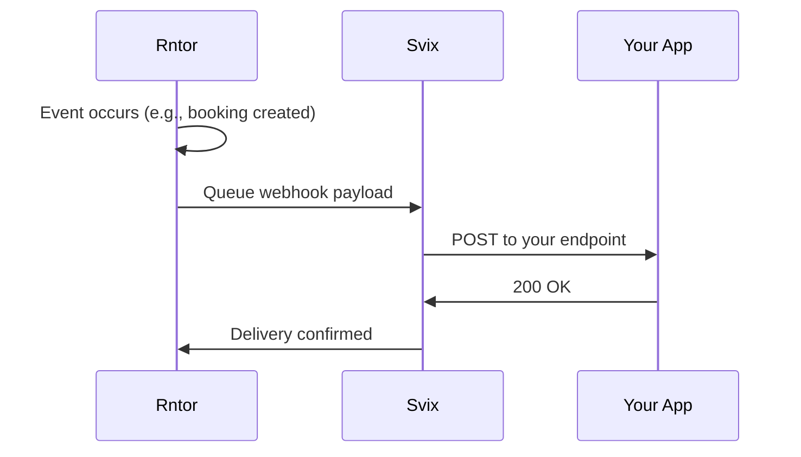

تتيح Webhooks لتطبيقك استقبال إشعارات في الوقت الفعلي عند وقوع الأحداث في Rntor. بدلاً من الاستطلاع للتغييرات، تدفع Rntor البيانات إلى نقطة النهاية الخاصة بك تلقائياً.

## كيف تعمل Webhooks



1. يقع حدث في Rntor (تم إنشاء حجز، تم تحديث عميل، إلخ)
2. تضع Rntor الحدث في قائمة انتظار صندوق الصادر لـ webhook
3. تسلّم Svix الحمولة إلى نقطة النهاية الخاصة بك
4. يعالج تطبيقك الحدث ويستجيب بـ `200 OK`

## بنية التسليم التحتية

تستخدم Rntor [Svix](https://www.svix.com) لتسليم webhook موثوق، مما يوفر:

- **إعادة المحاولات التلقائية** مع التراجع الأسي
- **التحقق من التوقيع** للأمان
- **سجلات التسليم** لتصحيح الأخطاء
- **إدارة نقاط النهاية** عبر بوابة خدمة ذاتية

## إعداد Webhooks

### 1. الوصول إلى بوابة Webhook

انتقل إلى **Settings → Developers → Webhooks** في لوحة تحكم Rntor الخاصة بك. ستُحمَّل بوابة Svix App.

### 2. إضافة نقطة نهاية

انقر على **Add Endpoint** وقم بتكوين:

| الحقل | الوصف |
| --- | --- |
| **URL** | عنوان URL لنقطة نهاية HTTPS الخاصة بك |
| **Description** | وصف اختياري لنقطة النهاية هذه |
| **Event Types** | الأحداث التي تريد استقبالها (أو الكل) |

<Warning>
  يجب أن تستخدم نقاط نهاية webhook بروتوكول HTTPS. لا تُدعم نقاط نهاية HTTP لأسباب أمنية.
</Warning>

### 3. اختيار الأحداث

اختر الأحداث التي تريد الاشتراك فيها:

```text
☑ booking.created
☑ booking.cancelled
☐ booking.updated
☐ booking.confirmed
☑ customer.created
...
```

<Tip>
  ابدأ بعدد قليل من الأحداث الرئيسية وأضف المزيد مع نمو تكاملك. اطّلع على جميع الأحداث المتاحة على [webhooks.rntor.com](https://webhooks.rntor.com/).
</Tip>

## استقبال Webhooks

تتلقى نقطة النهاية الخاصة بك طلبات `POST` تحتوي على:

### الرؤوس

| الرأس | الوصف |
| --- | --- |
| `Content-Type` | `application/json` |
| `svix-id` | معرّف الرسالة الفريد |
| `svix-timestamp` | الطابع الزمني Unix لمحاولة التسليم |
| `svix-signature` | التوقيع للتحقق |

### الجسم

```json
{
  "id": "f47ac10b-58cc-4372-a567-0e02b2c3d479",
  "resource_id": "a1b2c3d4-e5f6-7890-abcd-ef1234567890",
  "customer_id": "11111111-2222-3333-4444-555555555555",
  "status": "confirmed",
  "start_time": "2024-01-15T14:00:00Z",
  "end_time": "2024-01-15T15:00:00Z",
  "_meta": {
    "event_id": "msg_1234567890",
    "event_type": "booking.created",
    "merchant_id": "22222222-3333-4444-5555-666666666666",
    "timestamp": "2024-01-15T10:30:00.000Z"
  }
}
```

## الاستجابة لـ Webhooks

يجب على نقطة النهاية الخاصة بك:

1. **التحقق من التوقيع** (انظر [الأمان](/ar/webhooks/security))
2. **معالجة الحدث** (تحديث قاعدة البيانات، تشغيل سير العمل)
3. **الاستجابة برمز حالة `200-299`**

```javascript Example Handler
app.post('/webhooks/rntor', (req, res) => {
  // Verify signature (see Security page)
  if (!verifySignature(req)) {
    return res.status(401).send('Invalid signature');
  }
  
  const { _meta, ...payload } = req.body;
  
  switch (_meta.event_type) {
    case 'booking.created':
      handleNewBooking(payload);
      break;
    case 'customer.updated':
      updateCustomerRecord(payload);
      break;
  }
  
  res.status(200).send('OK');
});
```

<Warning>
  استجب في غضون **30 ثانية** وإلا فستنتهي مهلة الطلب وتُعاد محاولته.
</Warning>

## سياسة إعادة المحاولة

تُعاد محاولة عمليات التسليم الفاشلة مع التراجع الأسي:

| المحاولة | التأخير |
| --- | --- |
| إعادة المحاولة الأولى | 5 ثواني |
| إعادة المحاولة الثانية | 5 دقائق |
| إعادة المحاولة الثالثة | 30 دقيقة |
| إعادة المحاولة الرابعة | ساعتان |
| إعادة المحاولة الخامسة | 8 ساعات |
| إعادة المحاولة السادسة | يوم واحد |

بعد استنفاد جميع المحاولات، يتم تمييز الحدث على أنه فاشل. يمكنك إعادة المحاولة يدوياً من بوابة Svix.

## اختبار Webhooks

### التطوير المحلي

استخدم خدمة نفق لكشف خادمك المحلي:

```bash ngrok
ngrok http 3000
# Creates: https://abc123.ngrok.io → http://localhost:3000
```

أضف عنوان ngrok URL كنقطة نهاية في بوابة webhook.

### أحداث الاختبار

تتيح لك بوابة Svix إرسال أحداث اختبار:

1. انتقل إلى نقطة النهاية الخاصة بك في البوابة
2. انقر على **Send Test Event**
3. اختر نوع الحدث
4. انقر على **Send**

### عرض سجلات التسليم

صحّح عمليات التسليم الفاشلة عبر عرض السجلات في بوابة Svix:

- الطابع الزمني للتسليم
- رمز حالة الاستجابة
- جسم الاستجابة
- محاولات إعادة المحاولة

## أفضل الممارسات

<AccordionGroup>
  <Accordion title="عالج بشكل غير متزامن">
    ضع أحداث webhook في قائمة انتظار للمعالجة في الخلفية. أعد `200 OK` فوراً، ثم عالج الحدث بشكل غير متزامن لتجنب انتهاء المهلة.
  </Accordion>

  <Accordion title="عالج التكرارات">
    قد يتم تسليم Webhooks عدة مرات. استخدم `event_id` في `_meta` لإزالة تكرار الأحداث التي عالجتها بالفعل.
  </Accordion>

  <Accordion title="راقب صحة نقطة النهاية">
    أعد إعداد تنبيهات لعمليات تسليم webhook الفاشلة. تحقق من بوابة Svix بانتظام بحثاً عن مشكلات التسليم.
  </Accordion>

  <Accordion title="تحقق من صحة الحمولات">
    لا تثق ببيانات webhook بشكل أعمى. تحقق من وجود الكيانات المشار إليها (الحجوزات والعملاء) قبل المعالجة.
  </Accordion>
</AccordionGroup>

## الخطوات التالية

<CardGroup cols={2}>
  <Card title="التحقق من طلبات webhooks" icon="shield" href="/webhooks/security">
    طبّق التحقق من التوقيع
  </Card>

  <Card title="أنواع أحداث webhook" icon="list" href="https://webhooks.rntor.com/">
    تصفّح جميع أحداث webhook المتاحة
  </Card>
</CardGroup>