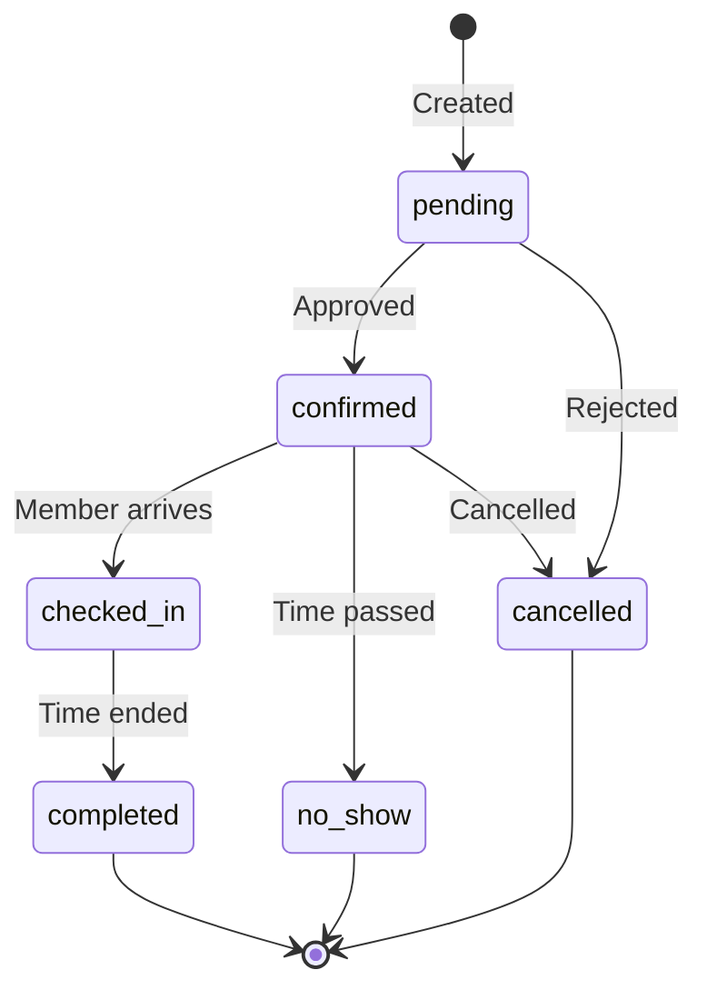

# Core Concepts

Before building your integration, it's important to understand how Rntor organizes data. This page covers the key entities and their relationships.

## Merchant Hierarchy

Rntor uses a hierarchical structure to organize spaces and resources:

```
Merchant (Organization)
├── Location (Physical Site)
│   ├── Floor (Optional)
│   │   └── Resource (Bookable Space)
│   └── Resource (Bookable Space)
└── Location
    └── Resource
```

### Merchant

A **Merchant** represents your organization or company. It's the top-level entity that owns all locations, customers, and settings.

- Has unique branding and configuration
- Contains all billing and subscription data
- Manages team members and permissions

### Location

A **Location** is a physical site or building. Merchants can have multiple locations.

- Has its own address and contact info
- Contains operating hours and closed days
- Groups resources for management

### Resource

A **Resource** is any bookable space or asset:

| Type | Description | Examples |
|------|-------------|----------|
| `meeting_room` | Rooms for meetings | Conference Room A, Boardroom |
| `hot_desk` | Flexible desk spaces | Open Workspace Desk #1-50 |
| `private_office` | Dedicated office spaces | Office Suite 201 |
| `event_space` | Large event venues | Rooftop Terrace, Main Hall |
| `phone_booth` | Small private booths | Phone Pod 1-4 |
| `parking` | Parking spaces | Spot A1-A20 |

## Customer Model

Rntor distinguishes between individual customers and company accounts:

```
Company (Optional)
├── Customer (Member)
├── Customer (Member)
└── Customer (Manager)
     └── Can manage company bookings
```

### Customer

A **Customer** is an individual user who can:
- Make bookings
- Attend events
- Use credits and day passes
- Have subscriptions

### Company

A **Company** groups customers together for:
- Shared billing
- Pooled credits and day passes
- Centralized invoicing
- Dedicated resource assignments

## Booking Lifecycle

Bookings move through defined statuses:



### Booking Statuses

| Status | Description |
|--------|-------------|
| `pending` | Awaiting confirmation (if approval required) |
| `confirmed` | Approved and scheduled |
| `checked_in` | Customer has arrived |
| `completed` | Booking time has ended |
| `cancelled` | Booking was cancelled |
| `no_show` | Customer didn't arrive |

## Credits & Day Passes

Rntor supports flexible payment models:

### Credits

A virtual currency for booking resources:
- Can be purchased in packages
- Included in subscription plans
- Track spending per customer/company
- Support partial payments

### Day Passes

All-access passes for a single day:
- Grant access to specific resource types
- Can be pooled at company level
- Often included in membership plans

## Subscriptions & Billing

Recurring memberships with automatic billing:

| Billing Cycle | Description |
|---------------|-------------|
| `monthly` | Billed on the same day each month |
| `quarterly` | Billed every 3 months |
| `annually` | Billed once per year |

Subscriptions can include:
- Access to specific locations
- Monthly credit allocations
- Day pass allocations
- Resource assignments (dedicated desks/offices)

## Events

Community events with registration:

- **Public Events**: Open to all, may require registration
- **Private Events**: Invite-only for specific customers
- **Paid Events**: Require payment via money or credits

## Rate Limiting

All API requests are subject to rate limits:

| Limit | Value | Response |
|-------|-------|----------|
| Per minute | 60 requests | `429 Too Many Requests` |
| Burst | 10 requests | Queued for processing |

<Tip>
  Implement exponential backoff when you receive a `429` response to avoid being temporarily blocked.
</Tip>

## IDs and References

All entities use UUIDs as primary identifiers:

```json
{
  "id": "f47ac10b-58cc-4372-a567-0e02b2c3d479",
  "merchant_id": "a1b2c3d4-e5f6-7890-abcd-ef1234567890",
  "location_id": "11111111-2222-3333-4444-555555555555"
}
```

When building integrations, store these IDs to reference entities in subsequent API calls.
