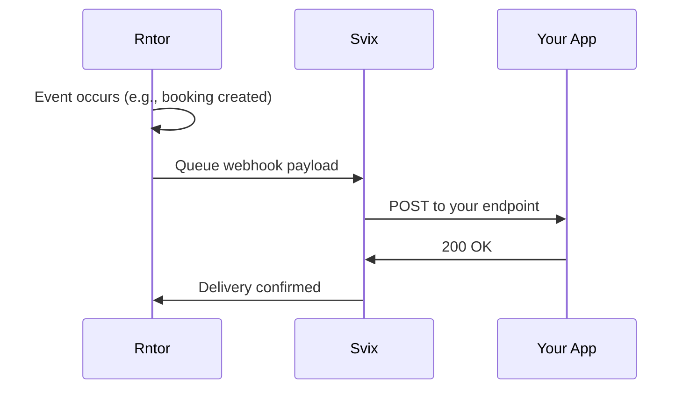

# Webhooks Overview

Webhooks let your application receive real-time notifications when events happen in Rntor. Instead of polling for changes, Rntor pushes data to your endpoint automatically.

## How Webhooks Work



1. An event occurs in Rntor (booking created, customer updated, etc.)
2. Rntor queues the event in the webhook outbox
3. Svix delivers the payload to your endpoint
4. Your app processes the event and responds with `200 OK`

## Delivery Infrastructure

Rntor uses [Svix](https://www.svix.com) for reliable webhook delivery, providing:

- **Automatic retries** with exponential backoff
- **Signature verification** for security
- **Delivery logs** for debugging
- **Endpoint management** through a self-service portal

## Setting Up Webhooks

### 1. Access the Webhook Portal

Navigate to **Settings → Developers → Webhooks** in your Rntor dashboard. The Svix App Portal will load.

### 2. Add an Endpoint

Click **Add Endpoint** and configure:

| Field | Description |
|-------|-------------|
| **URL** | Your HTTPS endpoint URL |
| **Description** | Optional description for this endpoint |
| **Event Types** | Which events to receive (or all) |

<Warning>
  Webhook endpoints must use HTTPS. HTTP endpoints are not supported for security reasons.
</Warning>

### 3. Select Events

Choose which events to subscribe to:

```
☑ booking.created
☑ booking.cancelled
☐ booking.updated
☐ booking.confirmed
☑ customer.created
...
```

<Tip>
  Start with a few key events and add more as your integration grows. See the [Event Catalog](/webhooks/event-catalog) for all available events.
</Tip>

## Receiving Webhooks

Your endpoint receives `POST` requests with:

### Headers

| Header | Description |
|--------|-------------|
| `Content-Type` | `application/json` |
| `svix-id` | Unique message ID |
| `svix-timestamp` | Unix timestamp of the delivery attempt |
| `svix-signature` | Signature for verification |

### Body

```json
{
  "id": "f47ac10b-58cc-4372-a567-0e02b2c3d479",
  "resource_id": "a1b2c3d4-e5f6-7890-abcd-ef1234567890",
  "customer_id": "11111111-2222-3333-4444-555555555555",
  "status": "confirmed",
  "start_time": "2024-01-15T14:00:00Z",
  "end_time": "2024-01-15T15:00:00Z",
  "_meta": {
    "event_id": "msg_1234567890",
    "event_type": "booking.created",
    "merchant_id": "22222222-3333-4444-5555-666666666666",
    "timestamp": "2024-01-15T10:30:00.000Z"
  }
}
```

## Responding to Webhooks

Your endpoint should:

1. **Verify the signature** (see [Security](/webhooks/security))
2. **Process the event** (update your database, trigger workflows)
3. **Respond with `200-299`** status code

```javascript Example Handler
app.post('/webhooks/rntor', (req, res) => {
  // Verify signature (see Security page)
  if (!verifySignature(req)) {
    return res.status(401).send('Invalid signature');
  }
  
  const { _meta, ...payload } = req.body;
  
  switch (_meta.event_type) {
    case 'booking.created':
      handleNewBooking(payload);
      break;
    case 'customer.updated':
      updateCustomerRecord(payload);
      break;
  }
  
  res.status(200).send('OK');
});
```

<Warning>
  Respond within **30 seconds** or the request will timeout and be retried.
</Warning>

## Retry Policy

Failed deliveries are retried with exponential backoff:

| Attempt | Delay |
|---------|-------|
| 1st retry | 5 seconds |
| 2nd retry | 5 minutes |
| 3rd retry | 30 minutes |
| 4th retry | 2 hours |
| 5th retry | 8 hours |
| 6th retry | 1 day |

After all retries are exhausted, the event is marked as failed. You can manually retry from the Svix portal.

## Testing Webhooks

### Local Development

Use a tunneling service to expose your local server:

```bash ngrok
ngrok http 3000
# Creates: https://abc123.ngrok.io → http://localhost:3000
```

Add the ngrok URL as an endpoint in the webhook portal.

### Test Events

The Svix portal allows you to send test events:

1. Go to your endpoint in the portal
2. Click **Send Test Event**
3. Select an event type
4. Click **Send**

### View Delivery Logs

Debug failed deliveries by viewing logs in the Svix portal:

- Delivery timestamp
- Response status code
- Response body
- Retry attempts

## Best Practices

<AccordionGroup>
  <Accordion title="Process asynchronously">
    Queue webhook events for background processing. Return `200 OK` immediately, then process the event asynchronously to avoid timeouts.
  </Accordion>

  <Accordion title="Handle duplicates">
    Webhooks may be delivered multiple times. Use the `event_id` in `_meta` to deduplicate events you've already processed.
  </Accordion>

  <Accordion title="Monitor endpoint health">
    Set up alerts for failed webhook deliveries. Check the Svix portal regularly for delivery issues.
  </Accordion>

  <Accordion title="Validate payloads">
    Don't trust webhook data blindly. Validate that referenced entities (bookings, customers) exist before processing.
  </Accordion>
</AccordionGroup>

## Next Steps

<CardGroup cols={2}>
  <Card title="Security" icon="shield" href="/webhooks/security">
    Implement signature verification
  </Card>
  <Card title="Event Catalog" icon="list" href="/webhooks/event-catalog">
    Browse all 21 webhook events
  </Card>
  <Card title="Payload Examples" icon="code" href="/webhooks/payload-examples">
    See real payload structures
  </Card>
  <Card title="Getting Started" icon="rocket" href="/getting-started">
    Complete setup guide
  </Card>
</CardGroup>
